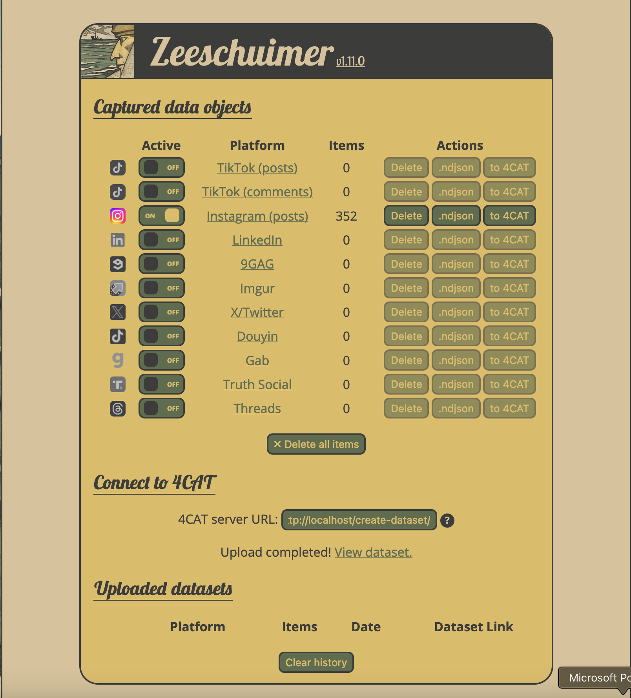
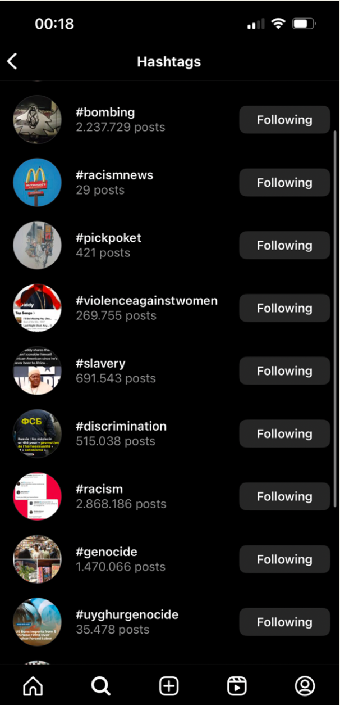

# Instagram Post Analysis

Bauhaus-Universität Weimar - MSc in Computer Science for Digital Media -Research Project I

## 📌 Summary

This project explores the automatic classification of Instagram posts into sentiment categories (positive, neutral, negative) using multimodal models. Inspired by the concept of “Information Nutrition Labels,” the project aims to provide a clearer understanding of online content quality through image-caption analysis.

## 🎯 Objective

The goal was to analyze social media posts through a machine learning pipeline and compare human-labeled results with AI-generated predictions. Multiple approaches, including zero-shot and fine-tuned models, were explored to improve accuracy and robustness in classifying online data.

## 🧠 Background

The idea stems from the article Shaping the Information Nutrition Label, which proposes labeling online content similarly to food nutrition labels. The project adapts this idea to Instagram data, focusing on the semantic quality and sentiment of visual + textual content.

## 📦 Dataset

Custom Dataset A: 132 Instagram posts manually labeled by the author.

External Dataset B: 952 Instagram posts with extended coverage.

Challenges faced:

- Class imbalance (initially few negative samples).

- Language mismatch due to non-English captions (translation issues).

Final dataset: Combined English-only captions from both sets.

## 🛠️ Technologies & Tools
Data collection: 4Cat, Instagram

Image model: ResNet50

Text model: BERT

Multimodal model: Combined ResNet50 + BERT pipeline

Prompt-based model: LLaVA (Large Language and Vision Assistant)

Frameworks: PyTorch, HuggingFace, CLIP
## 🔍 Methodology

### Approaches:

#### 1. Zero-Shot Classification with LLaVA on both datasets.

#### 2. Feature Extraction: ResNet50 + BERT, using frozen weights except last layers.

#### 3. Fine-Tuning:
        On Custom Dataset A
        On Custom Dataset A + External Dataset B

| Approach           | Dataset        | Accuracy   | Fine-Tuned |
| ------------------ | -------------- | ---------- | ---------- |
| LLaVA (zero-shot)  | Custom Dataset A           | 0.3401     | No         |
| LLaVA (zero-shot)  | Combined Dataset (A + B) | 0.3504     | No         |
| ResNet50+BERT (FE) | Custom Dataset A           | 0.6500     | Partial    |
| ResNet50+BERT (FE) | Combined Dataset (A + B) | 0.7431     | Partial    |
| ResNet50+BERT (FT) | Custom Dataset A           | 0.5500     | Full       |
| ResNet50+BERT (FT) | Combined Dataset (A + B) | **0.8194** | Full       |

## 📈 Impact

- Demonstrated that even small, real-world datasets can be used to train effective multimodal sentiment classifiers.

- Showed that fine-tuned models significantly outperform zero-shot prompting.

- Validated the viability of applying “information nutrition labels” to social media using machine learning.
## 📝 Notes

- Translating captions from non-English sources introduced semantic loss; future work could explore multilingual embeddings.

- Manual labeling was time-consuming but necessary to build initial benchmarks.

- The best-performing model was fine-tuned ResNet50+BERT on the combined dataset, reaching over 81% accuracy.

- Prompting alone (LLaVA) is not yet reliable for this task without additional tuning.
## ✅ Future Work

#### 1. Collect more balanced datasets (especially negative examples).

#### 2. Experiment with newer multimodal models like BLIP-2, Flamingo, or GIT.

#### 3. Develop a web interface for visualizing sentiment analysis as a nutrition label.
